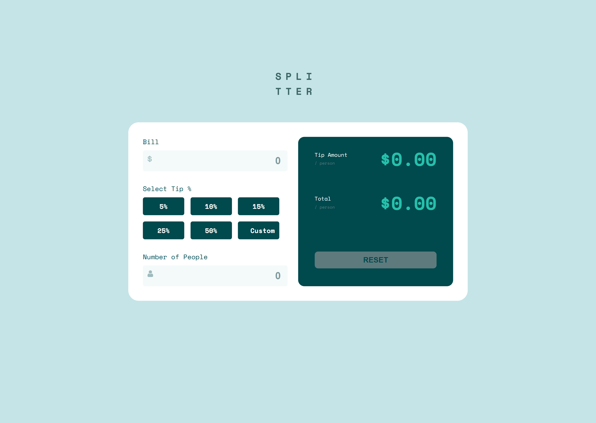

# Frontend Mentor - Tip calculator app solution

This is a solution to the [Tip calculator app challenge on Frontend Mentor](https://www.frontendmentor.io/challenges/tip-calculator-app-ugJNGbJUX). Frontend Mentor challenges help you improve your coding skills by building realistic projects.

## Table of contents

- [Overview](#overview)
  - [The challenge](#the-challenge)
  - [Screenshot](#screenshot)
  - [Links](#links)
- [My process](#my-process)
  - [Built with](#built-with)
  - [What I learned](#what-i-learned)
  - [Continued development](#continued-development)
- [Author](#author)

## Overview

### The challenge

Users should be able to:

- View the optimal layout for the app depending on their device's screen size
- See hover states for all interactive elements on the page
- Calculate the correct tip and total cost of the bill per person

### Screenshot

### Links

- Solution URL: [Add solution URL here](https://your-solution-url.com)
- Live Site URL: [Add live site URL here](https://your-live-site-url.com)

## My process

### Built with

- Semantic HTML5 markup
- CSS custom properties
- Flexbox
- CSS Grid
- Mobile-first workflow

### What I learned

For this challenges, i learned how to extract data from inputs and check for validation of the data. for example, a user cannot select number of people less than or equal to 0.
also, i learned how to show an input field triggered with user click to a specific button that's was a new idea for me.
finally, i learned how to show data whenever the user finish all the input fields and select a tip amount and clear the data if the user click on "clear" button.

### Continued development

I would focus more on trying to come up with new ideas that's help me for learning new things.

## Author

- Frontend Mentor - [@abdulrrahmann](https://www.frontendmentor.io/profile/abdulrrahmann)
